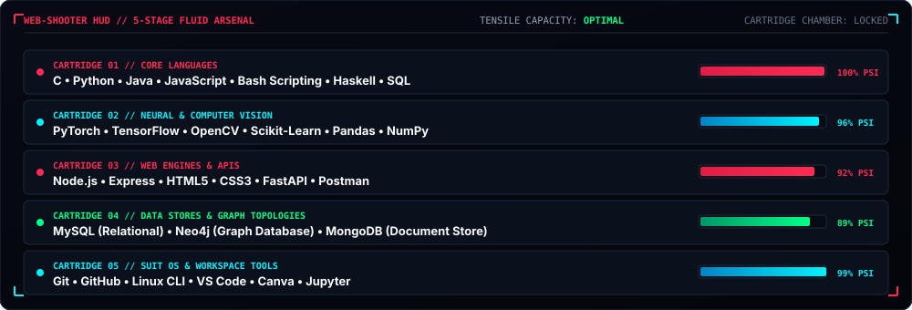

<!-- ================================================================= -->
<!-- SPIDER-LAB // SYSTEM INTERFACE                                    -->
<!-- ================================================================= -->

<div align="center">

  <!-- MASTER HUD HERO -->
  

  <br><br>

  <!-- ANIMATED SYSTEM TELEMETRY TYPING -->
  <a href="https://github.com/ajay9376">
    
  </a>

  <br>

  <!-- SYSTEM STATUS BADGE BAR -->
  <p align="center">
    <a href="https://linkedin.com/in/gujjula-ajay-kumar-29a6b3325/" target="_blank">
      
    </a>
    &nbsp;
    <a href="mailto:gujjulaajay9376@gmail.com">
      
    </a>
    &nbsp;
    <a href="https://github.com/ajay9376">
      
    </a>
    &nbsp;
    
    &nbsp;
    
  </p>

</div>

<p align="center">
  
</p>

<!-- ================================================================= -->
<!-- 01: ORIGIN // THE PETER PARKER PROTOCOL                           -->
<!-- ================================================================= -->


<br>

<table width="100%">
<tr>
<td bgcolor="#070b14" style="border: 1px solid #1e293b; border-radius: 10px; padding: 22px 26px;">

### 🕷️ Origin Dossier // Developer Identity

I am a Computer Science &amp; Engineering student at **Amrita Vishwa Vidyapeetham** (2nd Year), operating at the intersection of **Artificial Intelligence, Deepfake Forensics, Cybersecurity, and High-Performance Data Structures**.

Like Peter Parker in his lab, I believe engineering begins by peering beneath high-level abstractions — understanding how memory allocation, mathematical optimization, packet flows, and neural layers interact under pressure. My focus is engineering resilient, mathematically sound systems that detect anomalies and solve complex real-world challenges.

```python
# 🕸️ SUIT HUD // PROTOCOL: PETER_PARKER_V2
class PeterParkerDeveloper:
    def __init__(self):
        self.codename = "Gujjula Ajay Kumar"
        self.callsign = "Your Friendly Neighborhood Developer 🕷️"
        self.base_station = "Amrita Vishwa Vidyapeetham 🏛️"
        self.academic_track = "B.Tech Computer Science & Engineering (Class of 2028)"
        self.spider_sense = "ACTIVE // Detecting anomalies, bad logic & synthetic media"

    def core_subsystems(self):
        return {
            "ai_forensics": ["Deepfake Detection", "Multi-Signal Biometrics", "Computer Vision"],
            "cyber_radar": ["Traffic Telemetry", "Anomaly Detection", "Threat Classification"],
            "algorithmic_craft": ["Graph Theory", "Constraint Satisfaction", "DAA Optimization"],
            "systems_stack": ["Python", "C", "Java", "Node.js", "MySQL", "Neo4j"]
        }

    def prime_directive(self):
        return "With great compute power comes great architectural responsibility."
```

```bash
┌──(ajay㉿spider-suit-os)-[~/radar]
└─$ spider-cli telemetry --verify
[SYSTEM]       SPIDER-LAB OS v4.2 INITIALIZED
[SPIDER-SENSE] Calibrated to anomalous telemetry & deepfake vectors
[FIREWALL]     NetSentinel packet inspector ACTIVE
[CSP_SOLVER]   Map Puzzle chromatic graph engine ONLINE
[OBJECTIVE]    Architecting resilient AI systems & mastering core algorithms
```

</td>
</tr>
</table>

<p align="center">
  
</p>

<!-- ================================================================= -->
<!-- 02: SPIDER-SENSE // THREAT & LEARNING RADAR                       -->
<!-- ================================================================= -->


<br>

<div align="center">
  
</div>

<p align="center">
  
</p>

<!-- ================================================================= -->
<!-- 03: WEB-SHOOTER ARSENAL // TECHNICAL WEAPONRY                    -->
<!-- ================================================================= -->


<br>

<div align="center">
  
</div>

<br>

<!-- INTERACTIVE SKILL ICONS MATRIX -->
<table width="100%">
<tr>
<td bgcolor="#070b14" style="border: 1px solid #1e293b; border-radius: 10px; padding: 18px 24px;">

<div align="center">

<p>
  <b>🕸️ Core Languages</b><br>
  
</p>

<p>
  <b>🧠 AI, Machine Learning &amp; Computer Vision</b><br>
  
</p>

<p>
  <b>🌐 Web Engineering &amp; APIs</b><br>
  
</p>

<p>
  <b>🗄️ Relational &amp; Graph Databases</b><br>
  
</p>

<p>
  <b>🛠️ Developer Tools &amp; Operating Systems</b><br>
  
</p>

</div>

</td>
</tr>
</table>

<p align="center">
  
</p>

<!-- ================================================================= -->
<!-- 04: ACTIVE MISSIONS // THE SPIDER-LAB                             -->
<!-- ================================================================= -->


<br>

<!-- MISSION GRID -->
<table width="100%">
<tr>
<!-- MISSION 001: TRUTHLENS-AI -->
<td width="50%" valign="top" bgcolor="#070b14" style="border: 1px solid #FF2A54; border-radius: 10px; padding: 16px;">


<br><br>

> **Tactical Objective:** Detect synthetic media &amp; hyper-realistic deepfakes that deceive the human eye.

Cross-examines 4 distinct visual &amp; biometric signal vectors:
- **Facial Texture Warping:** Analyzes boundary distortions &amp; GAN blending artifacts.
- **Frequency Spectrum Inconsistencies:** Detects anomalous high-frequency pixel harmonics.
- **Eye-Blink Dynamics:** Evaluates biological cadence &amp; involuntary eyelid motion.
- **Residual Noise Patterns:** Spots synthetic PRNU fingerprint discrepancies.

<p>
  
</p>

- **Status:** `ACTIVE // REAL-TIME INFERENCE`
- **Architecture:** `Python` &bull; `OpenCV` &bull; `Deep Learning` &bull; `Streamlit` &bull; `Computer Vision`

<p align="right"><a href="https://github.com/ajay9376/TruthLens-AI"><b>🕷️ Access Mission Files &rarr;</b></a></p>

</td>

<!-- MISSION 002: NETSENTINEL -->
<td width="50%" valign="top" bgcolor="#070b14" style="border: 1px solid #00F2FE; border-radius: 10px; padding: 16px;">


<br><br>

> **Tactical Objective:** Autonomous network radar intercepting malicious traffic at the perimeter.

An intelligent cybersecurity watchdog providing real-time telemetry:
- **Packet Telemetry:** Live traffic capture and protocol dissection via Scapy.
- **Anomaly Radar:** Statistical baseline deviation &amp; zero-day signature scoring.
- **Threat Classification:** Supervised ML categorization of intrusion vectors.
- **Automated Alerts:** High-priority mitigation dispatching for network defenders.

<p>
  
</p>

- **Status:** `ARMED // PERIMETER GUARD`
- **Architecture:** `Python` &bull; `Scapy` &bull; `Scikit-Learn` &bull; `Network Telemetry` &bull; `Jupyter`

<p align="right"><a href="https://github.com/ajay9376/NetSentinel"><b>🛡️ Access Mission Files &rarr;</b></a></p>

</td>
</tr>

<tr>
<!-- MISSION 003: MAP PUZZLE DAA -->
<td width="50%" valign="top" bgcolor="#070b14" style="border: 1px solid #00F2FE; border-radius: 10px; padding: 16px;">


<br><br>

> **Tactical Objective:** Solve complex geographic partitioning and Constraint Satisfaction Problems (CSPs).

An algorithmic graph coloring engine designed for minimum-chromatic partitioning:
- **Constraint Satisfaction (CSP):** Formulates state boundaries as graph adjacency matrices.
- **Backtracking with Forward Checking:** Prunes non-viable branches from state-space trees.
- **Greedy Heuristic Search:** Implements Welsh-Powell degree ordering &amp; DSatur saturation degree.
- **Complexity Bound Analysis:** Evaluates chromatic numbers under varying graph densities.

<p>
  
</p>

- **Status:** `SOLVED // CHROMATIC OPTIMIZATION`
- **Architecture:** `Python` &bull; `Graph Theory` &bull; `Backtracking` &bull; `DAA` &bull; `Greedy Heuristics`

<p align="right"><a href="https://github.com/ajay9376/Map_Puzzle_DAA"><b>🧩 Access Mission Files &rarr;</b></a></p>

</td>

<!-- MISSION 004: ML-CAPSTONE -->
<td width="50%" valign="top" bgcolor="#070b14" style="border: 1px solid #FF2A54; border-radius: 10px; padding: 16px;">


<br><br>

> **Tactical Objective:** End-to-end predictive modeling across supervised &amp; unsupervised paradigms.

Comprehensive machine learning experimentation framework:
- **Data Engineering:** Automated missing value imputation, outlier detection, scaling.
- **Dimensionality Reduction:** Principal Component Analysis (PCA) variance preservation.
- **Model Benchmarking:** Cross-validated regression, classification, and clustering comparison.
- **Diagnostic Metrics:** ROC-AUC curves, confusion matrices, and silhouette coefficient tuning.

<p>
  
</p>

- **Status:** `DEPLOYED // RESEARCH PIPELINE`
- **Architecture:** `Scikit-Learn` &bull; `Pandas` &bull; `NumPy` &bull; `Seaborn` &bull; `Matplotlib`

<p align="right"><a href="https://github.com/ajay9376/ML-Capstone"><b>⚡ Access Mission Files &rarr;</b></a></p>

</td>
</tr>

<tr>
<!-- MISSION 005: CGPA CALCULATOR -->
<td colspan="2" valign="top" bgcolor="#070b14" style="border: 1px solid #1e293b; border-radius: 10px; padding: 16px;">


<br><br>

> **Tactical Objective:** Client-side academic performance metric evaluator for engineering cohorts.

An interactive browser utility allowing university students to input course credits, letter grades, and semester weights to compute cumulative grade point averages (CGPA) with zero latency.

- **Status:** `COMPLETED // SYSTEM UTILITY`
- **Architecture:** `HTML5` &bull; `CSS3` &bull; `JavaScript` &bull; `Responsive DOM Manipulation`

<p align="right"><a href="https://github.com/ajay9376/cgpa_calculator"><b>🎓 Access Utility &rarr;</b></a></p>

</td>
</tr>
</table>

<p align="center">
  
</p>

<!-- ================================================================= -->
<!-- 05: THE WEB // GITHUB TELEMETRY & CONTRIBUTION RADAR              -->
<!-- ================================================================= -->


<br>

<div align="center">

  <table border="0">
    <tr>
      <td align="center" valign="middle">
        <a href="https://github.com/ajay9376">
          
        </a>
      </td>
      <td align="center" valign="middle">
        <a href="https://github.com/ajay9376">
          
        </a>
      </td>
    </tr>
    <tr>
      <td colspan="2" align="center">
        <br>
        <a href="https://github.com/ajay9376">
          
        </a>
      </td>
    </tr>
  </table>

</div>

<p align="center">
  
</p>

<!-- ================================================================= -->
<!-- 06: SPIDER-ACADEMY // FORMAL EDUCATION                            -->
<!-- ================================================================= -->


<br>

<table width="100%">
<tr>
<td bgcolor="#070b14" style="border: 1px solid #1e293b; border-radius: 10px; padding: 22px 28px;">

### 🏛️ Amrita Vishwa Vidyapeetham
**Bachelor of Technology (B.Tech) — Computer Science &amp; Engineering (2024 – 2028)**

- **Core Academic Rigor:** Data Structures &amp; Algorithms, Object-Oriented Programming (Java), Operating Systems &amp; Concurrency, Database Management Systems (SQL &amp; Neo4j), Computer Networks, Design &amp; Analysis of Algorithms (DAA), Artificial Intelligence.
- **Engineering Trajectory:** Deepening mastery in computer vision forensics, anomaly detection architectures, low-level concurrency, and graph constraint optimization.

</td>
</tr>
</table>

<p align="center">
  
</p>

<!-- ================================================================= -->
<!-- 07: DEVELOPER CREED // SYSTEM DIRECTIVES                          -->
<!-- ================================================================= -->


<br>

<table width="100%">
<tr>
<td bgcolor="#050811" style="border: 1px solid #FF2A54; border-radius: 10px; padding: 20px 24px;">

```bash
┌──(ajay㉿spider-lab-core)-[~/directives]
└─$ cat creed.sh

[DIRECTIVE 01] WITH GREAT COMPUTE COMES GREAT RESPONSIBILITY
               Software controls real-world infrastructure. Write deterministic, tested,
               and verified code that fails safely and recovers gracefully.

[DIRECTIVE 02] DEVELOP INSTINCTIVE SPIDER-SENSE
               Detect edge cases, race conditions, memory leaks, and malicious packet
               payloads before they cascade into system failures.

[DIRECTIVE 03] WEAVE INTERCONNECTED RESILIENCE
               Build modular architectures where individual nodes can degrade without
               collapsing the greater network. Fault-tolerance by design.

[DIRECTIVE 04] RELENTLESS EXPLORATION
               Never stop leaping. Push beyond standard abstractions to master the
               mechanics of neural networks, memory management, and network protocols.
```

</td>
</tr>
</table>

<p align="center">
  
</p>

<!-- ================================================================= -->
<!-- 08: ENTER THE SPIDER-VERSE // DIMENSIONAL GATEWAY                 -->
<!-- ================================================================= -->


<br>

<div align="center">
  <a href="https://github.com/ajay9376">
    
  </a>
</div>

<p align="center">
  
</p>

<!-- ================================================================= -->
<!-- 09: TRANSMISSION // SECURE CHANNELS                               -->
<!-- ================================================================= -->


<br>

<p align="center">
  Open to collaborative AI research, deepfake forensics, systems engineering, and open-source innovations.
  <br>
  <b>Spider-Lab frequencies are open. Send an encrypted ping:</b>
</p>

<p align="center">
  <a href="https://linkedin.com/in/gujjula-ajay-kumar-29a6b3325/" target="_blank">
    
  </a>
  &nbsp;&nbsp;
  <a href="https://github.com/ajay9376" target="_blank">
    
  </a>
  &nbsp;&nbsp;
  <a href="mailto:gujjulaajay9376@gmail.com">
    
  </a>
</p>

<br>

<div align="center">
  <hr style="border: 0; height: 1px; background: #FF2A54;">
  <p align="center">
    <sub>🕷️ <i>"Anyone can wear the mask. It's how you architect the system that changes the world."</i> &bull; <b>Gujjula Ajay Kumar</b> &bull; Amrita Vishwa Vidyapeetham ⚡</sub>
  </p>
  
</div>
